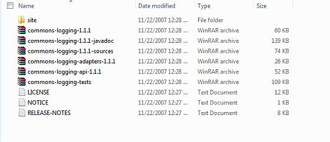

# Spring——环境设置

本教程将指导你如何准备开发环境来使用 Spring 框架开始你的工作。本教程还将教你在安装 Spring 框架之前如何在你的机器上安装 JDK，Tomcat 和 Eclipse： 

## 第 1 步——安装 Java 开发工具包（JDK）：

你可以从 Oracle 的 Java 网站 [**Java SE Downloads**](http://www.oracle.com/technetwork/java/javase/downloads/index.html) 下载 SDK 的最新版本。你会在下载的文件中找到教你如何安装 JDK 的说明，按照给出的说明安装和配置 JDK 的设置。最后，设置 PATH 和 JAVA_HOME 环境变量，引入包含 java 和 javac 的目录，通常分别为 java _ install _ dir/bin 和 java _ install _ dir。 

如果你运行的是Windows，并在C:\jdk1.6.0_15上安装了JDK，你就可以把下面这行写入C:\autoexec.bat文件中。

``` 
set PATH=C:\jdk1.6.0_15\bin;%PATH%
set JAVA_HOME=C:\jdk1.6.0_15
```

或者，在 Windows NT/2000/XP 中，你也可以右键单击“我的电脑”，选择“属性”，然后是“高级”，然后是“环境变量”。接下来，你将更新 PATH 值，并且按下 OK 按钮。

在 Unix(Solaris、Linux 等等)上，如果在 /usr/local/jdk1.6.0_15 上安装 SDK，并且使用 C shell 命令，你将把下面的内容添加到 .cshrc 文件中。

``` 
setenv PATH /usr/local/jdk1.6.0_15/bin:$PATH
setenv JAVA_HOME /usr/local/jdk1.6.0_15
```

或者，如果你使用集成开发环境（IDE），如 Borland JBuilder，Eclipse，IntelliJ IDEA 或者 Sun ONE Studio，编译和运行一个简单的程序，用来确认 IDE 知道你安装了 Java，否则应该根据 IDE 给定的文档做正确的设置。 

## 第 2 步——安装 Apache Commons Logging API：

你可以从 [**http://commons.apache.org/logging/**](http://commons.apache.org/logging/download_logging.cgi) 下载 Apache Commons Logging API 的最新版本。一旦你下载完安装包，并且解压二进制的发行版本到一个方便的位置。例如在 windows 上的 C:\commons-logging-1.1.1 中，或在 Linux/Unix 上的 /usr/local/commons-logging-1.1.1 中。该目录将有如下的 jar 文件和其他支持的文件等。



确保你在这个目录上正确的设置 CLASSPATH 变量，否则你将会在运行应用程序时遇到问题。

## 第 3 步——安装 Eclipse IDE

本教程中的所有例子使用 Eclipse IDE 编写。所以我建议你应该在你的机器上安装 Eclipse 的最新版本。

为了安装 Eclipse IDE，从 [**http://www.eclipse.org/downloads/**](http://www.eclipse.org/downloads/) 上下载最新的 Eclipse 二进制文件。一旦你下载完安装包，并且解压二进制的发行版本到一个方便的位置。例如在 windows 上的 C:\eclipse 中，或在 Linux/Unix 上的 /usr/local/eclipse 中，最后恰当的设置 PATH 变量。

在 Windows 机器上，可以通过执行以下命令启动 Eclipse，或者可以简单地双击 eclipse.exe。

``` 
%C:\eclipse\eclipse.exe
```

在 Unix（Solaris 和 Linux 等）上，可以通过执行下面的命令启动 Eclipse：

``` 
$/usr/local/eclipse/eclipse
```

启动成功后，如果一切正常，它应该显示下面的结果：


## 第 4 步——安装 Spring 框架库

现在如果一切正常，你就可以继续设置你的 Spring 框架。下面是在你的机器上下载并安装框架的简单步骤。

- 选择是要在 Windows 还是在 UNIX 上安装 Spring，然后继续进行下一个步骤，在 Windows 上下载 .zip 文件,而在 Unix 上下载 .tz 文件。

- 从 [http://repo.spring.io/release/org/springframework/spring](http://repo.spring.io/release/org/springframework/spring) 下载最新版本的 Spring 框架的二进制文件。

- 在写本教程的时候，我在我的 Windows 机器上下载了 **spring-framework-4.1.6.RELEASE-dist.zip**，当你解压缩下载的文件时，它内置的目录结构为 E:\spring，如下所示。


你会在目录 **E:\spring\libs** 中发现所有的 Spring 库。确保你在这个目录上正确的设置 CLASSPATH 变量，否则你将会在运行应用程序时遇到问题。如果使用的是 Eclipse，就不需要设置 CLASSPATH，因为所有的设置将通过 Eclipse 完成。

一旦你完成了最后一步后，你就可以继续你的第一个 Spring 例子，你将会在下一章中看到。
