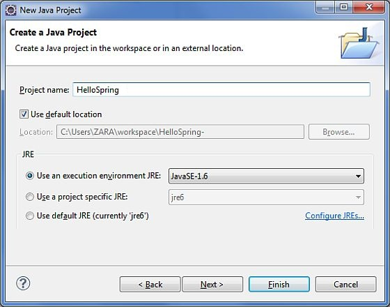
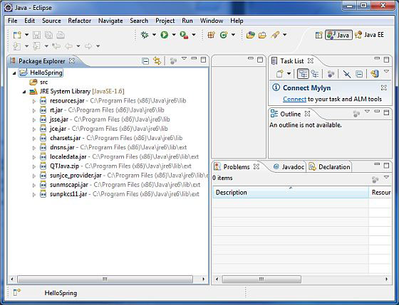
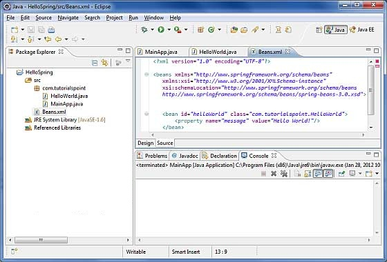

# Spring——Hello World 实例 

让我们使用 Spring 框架开始实际的编程。在你开始使用 Spring 框架编写第一个例子之前，你必须确保已经正确地设置了 Spring 环境，正如在 [**Spring——环境设置**](http://www.tutorialspoint.com/spring/spring_environment_setup.htm)教程中如所说的。假设你有了解一些有关 Eclipse IDE 工作的知识。 

因此，让我们继续编写一个简单的 Spring 应用程序，它将根据在 Spring Beans 配置文件中配置的信息输出 “Hello World！” 或其他信息。

## 第 1 步——创建 Java 项目：

第一步是使用 Eclipse IDE 创建一个简单的 Java 项目。按照选项 **File -> New -> Project**，最后从向导列表中选择 **Java Project** 向导。现在，使用向导窗口将你的项目命名为 **HelloSpring**，如下所示：



一旦你的项目创建成功后，将在 **Project Explorer** 看到下面的内容：



## 第 2 步_添加必需的库：

第二步让我们添加 Spring 框架和通用的日志 API 库到我们的项目中。为了做到这个，在你的项目名称 **HelloSpring** 上单击右键，然后在快捷菜单上按照下面可用的选项：**Build Path -> Configure Build Path** 显示 Java 构建路径窗口，如下所示：


现在，在 **Libraries** 标签中使用可用的 **Add External JARs** 按钮，添加从 Spring 框架和通用日志安装目录下面的核心 JAR 文件：

- commons-logging-1.1.1

- spring-aop-4.1.6.RELEASE

- spring-aspects-4.1.6.RELEASE

- spring-beans-4.1.6.RELEASE

- spring-context-4.1.6.RELEASE

- spring-context-support-4.1.6.RELEASE

- spring-core-4.1.6.RELEASE

- spring-expression-4.1.6.RELEASE

- spring-instrument-4.1.6.RELEASE

- spring-instrument-tomcat-4.1.6.RELEASE

- spring-jdbc-4.1.6.RELEASE

- spring-jms-4.1.6.RELEASE

- spring-messaging-4.1.6.RELEASE

- spring-orm-4.1.6.RELEASE

- spring-oxm-4.1.6.RELEASE

- spring-test-4.1.6.RELEASE

- spring-tx-4.1.6.RELEASE

- spring-web-4.1.6.RELEASE

- spring-webmvc-4.1.6.RELEASE

- spring-webmvc-portlet-4.1.6.RELEASE

- spring-websocket-4.1.6.RELEASE

## 第 3 步——创建源文件： 

现在让我们在 **HelloSpring** 项目下创建实际的源文件。首先，我们需要创建一个名为 **com.tutorialspoint** 的包。为了做到这个，在 package explore 区域中的 **src** 上点击右键，并按照选项：**New -> Package**。

接下来，我们在包 com.tutorialspoint 下创建 **HelloWorld.java** 和 **MainApp.java** 文件。


这里是 **HelloWorld.java** 文件的内容：

``` 
package com.tutorialspoint;
public class HelloWorld {
   private String message;
   public void setMessage(String message){
      this.message  = message;
   }
   public void getMessage(){
      System.out.println("Your Message : " + message);
   }
}
```

下面是第二个文件 **MainApp.java** 的内容：

``` 
package com.tutorialspoint;
import org.springframework.context.ApplicationContext;
import org.springframework.context.support.ClassPathXmlApplicationContext;
public class MainApp {
   public static void main(String[] args) {
      ApplicationContext context = 
             new ClassPathXmlApplicationContext("Beans.xml");
      HelloWorld obj = (HelloWorld) context.getBean("helloWorld");
      obj.getMessage();
   }
}
```

关于主要程序有以下两个要点需要注意：

- 第一步是我们使用框架 API **ClassPathXmlApplicationContext()** 来创建应用程序的上下文。这个 API 加载 beans 的配置文件并最终基于所提供的 API，它处理创建并初始化所有的对象，即在配置文件中提到的 beans。

- 第二步是使用已创建的上下文的 **getBean() **方法来获得所需的 bean。这个方法使用 bean 的 ID 返回一个最终可以转换为实际对象的通用对象。一旦有了对象，你就可以使用这个对象调用任何类的方法。

##第 4 步——创建 bean 的配置文件：

你需要创建一个 Bean 的配置文件，该文件是一个 XML 文件，并且作为粘合 bean 的粘合剂即类。这个文件需要在 **src** 目录下创建，如下图所示：



通常开发人员保存该文件的名称为 **Beans.xml** 文件，但是你可以单独选择你喜欢的任何名称。你必须确保这个文件在 CLASSPATH 中是可用的，并在主应用程序中使用相同的名称，而在 MainApp.java 文件中创建应用程序的上下文，如图所示。

Beans.xml 用于给不同的 bean 分配唯一的 ID，并且控制不同值的对象的创建，而不会影响 Spring 的任何源文件。例如，使用下面的文件，你可以为 “message” 变量传递任何值，因此你就可以输出信息的不同值，而不会影响的 HelloWorld.java和MainApp.java 文件。让我们来看看它是如何工作的：

<pre class="prettyprint notranslate">
&lt;?xml version="1.0" encoding="UTF-8"?&gt;

&lt;beans xmlns="http://www.springframework.org/schema/beans"
    xmlns:xsi="http://www.w3.org/2001/XMLSchema-instance"
    xsi:schemaLocation="http://www.springframework.org/schema/beans
    http://www.springframework.org/schema/beans/spring-beans-3.0.xsd"&gt;

   &lt;bean id="helloWorld" class="com.tutorialspoint.HelloWorld"&gt;
       &lt;property name="message" value="Hello World!"/&gt;
   &lt;/bean&gt;

&lt;/beans&gt;
</pre> 


当 Spring 应用程序被加载到内存中时，框架利用了上面的配置文件来创建所有已经定义的 beans，并且按照 **<bean>** 标签的定义为它们分配一个唯一的 ID。你可以使用 **<property>** 标签来传递在创建对象时使用不同变量的值。

## 第 5 步——运行程序： 

一旦你完成了创建源代码和 bean 的配置文件后，准备好下一步编译和运行你的程序。为了做到这个，请保持 MainApp.Java 文件标签是**有效**的，并且在 Eclipse IDE 中使用可用的 Run 选项，或使用 **Ctrl + F11** 编译并运行你的应用程序 **MainApp**。如果你的应用程序一切都正常，将在 Eclipse IDE 控制台打印以下信息：

<pre class="prettyprint notranslate">
Your Message : Hello World!
</pre> 

祝贺，你已经成功地创建了你的第一个 Spring 应用程序。通过更改 “message” 属性的值并且保持两个源文件不变，你可以看到上述 Spring 应用程序的灵活性。下一步，我们开始在接下来的几个章节中做一些更有趣的事情。

