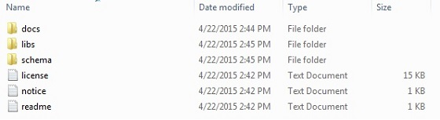
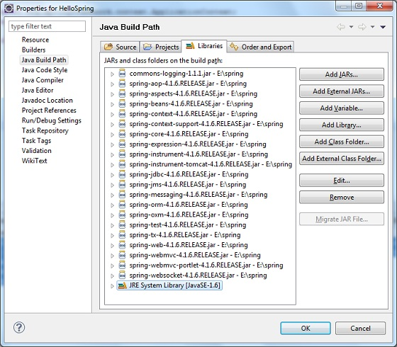
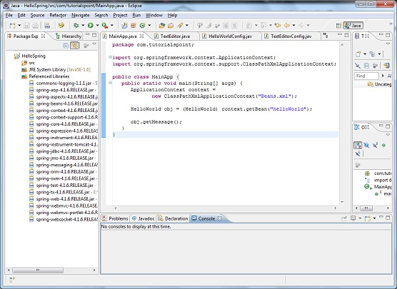

# Spring——快速指南

Spring 是最受欢迎的企业级 Java 应用程序开发框架。数以百万的来自世界各地的开发人员使用 Spring 框架来创建好性能、易于测试、可重用的代码。

Spring 框架是一个开源的 Java 平台，它最初是由 Rod Johnson 编写的，并且2003年6月首次在 Apache 2.0 许可下发布。

当谈论到大小和透明度时， Spring 是轻量级的。 Spring 框架的基础版本是在 2 MB 左右的。

Spring 框架的核心特性可以用于开发任何 Java 应用程序，但是在 Java EE 平台上构建 web 应用程序是需要扩展的。 Spring 框架的目标是使 J2EE 开发变得更容易使用，通过启用基于 POJO 编程模型来促进良好的编程实践。

## 使用 Spring 框架的好处：

下面列出的是使用 Spring 框架的主要的好处：

- Spring 可以使开发人员使用 POJOs 开发企业级的应用程序。只使用 POJOs 的好处是你不需要一个 EJB 容器产品，比如一个应用程序服务器，但是你可以选择使用一个健壮的 servlet 容器，比如 Tomcat 或者一些商业产品。

- Spring 在一个单元模式中是有组织的。即使包和类的数量非常大，你必须并且只需要但是你需要的，而忽略剩余的那部分。

- Spring 不会让你白费力气坐重复工作，它真正的利用了一些现有的技术，像几个 ORM 框架、日志框架、JEE、Quartz 和 JDK 计时器，其他视图技术。

- 测试一个用 Spring 编写的应用程序很容易，因为 environment-dependent 代码被放进了这个框架中。此外，通过使用 JavaBean-style POJOs，它在使用依赖注入注入测试数据时变得更容易。

- Spring 的 web 框架是一个设计良好的 web MVC 框架，它为 web 框架，比如 Structs 或者其他工程上的或者很少受欢迎的 web 框架，提供了一个很好的供替代的选择。

- 为将特定技术的异常（例如，由 JDBC、Hibernate，或者 JDO 抛出的异常）翻译成一致的， Spring 提供了一个方便的 API，而这些都是未经检验的异常。

- 轻量级的 IOC 容器往往是轻量级的，例如，特别是当与 EJB 容器相比的时候。这有利于在内存和 CPU 资源有限的计算机上开发和部署应用程序。

- Spring 提供了一个一致的事务管理界面，该界面可以缩小成一个本地事务（例如，使用一个单一的数据库）和扩展成一个全局事务（例如，使用 JTA）。

# Spring 框架体系结构

对于你的所有的企业级的应用程序来说， Spring 可能是一个一站式的商店，然而， Spring 是模块化的，允许你选择哪些模块适用于你，而不需要引入其余部分。下一节为你详细介绍在 Spring 框架中所有可用的模块。

Spring 框架提供了大约 20 个模块，这些模块可以基于一个应用程序的需求来使用。


## 核心容器：

核心容器是由核心、Beans、上下文，和表达式语言模块组成，它们的详细内容如下：

- **核心**模块提供了框架的基本部分，包括 IOC 和依赖注入特性。

- **Bean** 模块提供了 BeanFactory，它是一个复杂的工厂模式的实现。

- **上下文**模块是建立在由核心模块和 Bean 模块提供的坚实的基础上的，它是访问任何对象的定义和配置的一个媒介。应用程序上下文的接口是上下文模块的焦点。

- **SpEL** 模块在运行时为查询和操纵一个对象图提供了一个强大的表达式语言。

## 数据访问/集成：

数据访问和集成层是由 JDBC、ORM、OXM、JMS 和事务模块构成，这些模块的详细内容如下：

- **JDBC** 模块提供了一个 JDBC-abstraction 层，它可以消除乏味的与 JDBC 相关的代码。

- **ORM** 模块为流行的对象-关系映射 APIs，包括 JPA、JDO、Hibernate，和 iBatis 提供了集成层。

- **OXM** 模块提供了一个抽象层，对 JAXB、Castor、XMLBeans、JiBX 和 XStream，它支持对象/ XML 映射实现。

- Java 消息传递服务 **JMS** 模块包含制造和消耗消息的功能。

- 对于类，**事务**模块支持编程和声明式的事务管理，它可以实现特殊的接口和你所有的 POJOs。

## 网络：

网络层包括 Web、Web-MVC、Web-Socket，和 Web-Portlet 模块，它们的详细内容如下：

- **Web** 模块提供了基本的面相 web 的集成特性，比如多部分文件上传功能和使用 servlet 侦听器和一个面向 web 的应用程序上下文对 IOC 容器的初始化。

- **Web-MVC** 模块包含为实现 web 应用程序的 Spring的模型-视图-控制器（MVC）。

- **Web-Socket** 模块支持基于 WebSocket、web 应用程序中客户端和服务器之间的双重通信。

- **Web-Portlet** 模块 MVC 实现，可以用于一个 portlet 环境和 Web-Servlet 模块的反射功能。

## 其他参数：

还有几个其他重要的模块像 AOP、Aspects、Instrumentation、Web 和 测试模块，它们的详细内容如下：

- **AOP** 模块提供了面向 aspect 的编程实现，允许你定义拦截方法和切入点来清楚地分离代码，实现分开功能。

- **Aspects** 模块用 AspectJ 提供集成，AspectJ 是另一个强大的并且成熟的面向 aspect 编程（AOP）框架。

- **Instrumentation** 模块提供了用于热定应用程序服务器的类仪器支持和类加载器的实现。

- **消息传递**模块为在应用程序中作为 WebSocket 子协议的 STOMP 提供了支持。它还为在 WebSocket 客户端得路径选择和处理 STOMP 消息支持一个注释编程模型。

- **测试**模块支持使用 JUnit 或者TestNG 框架的 Spring 组件。

# Spring 环境设置

我假设你已经为 Java 开发工具包（JDK）和 Eclipse IDE 进行了设置。现在让我们看看如何设置 Spring 框架库：

下面是下载并在你的计算机上安装框架的简单的步骤。

- 对你想要在 Windows 或者 Unix 上安装 Spring 做出选择，然后继续下一步为你的 Windows 下载 .zip 文件和为 Unix 下载 .tz 文件。

- 从 [http://repo.spring.io/release/org/springframework/spring](http://repo.spring.io/release/org/springframework/spring/) 下载 Spring 框架的最新版本的二进制文件。

- 写这篇教程的时候，我下载的是 **Spring-framework-4.1.6.RELEASE-dist.zip**。当你解压下载的文件时，它将在 E:\spring 内部给你目录结构，如下所示：



你将在 **E:\spring\libs** 目录里看到所有的 Spring 库。确保你在这个目录里设置合适的 CLASSPATH 变量，否则当你运行你的应用程序时你将会面临问题。

一旦你完成了最后一步，你已经准备好开始你的第一个 Spring 例子。

# Spring Hello World 示例

让我们开始真正的使用 Spring 框架进行编程。在你开始使用 Spring 框架写你的第一个示例之前，你必须确保你已经设置好你的 Spring 环境，就如 [**Spring - 环境设置**](http://www.tutorialspoint.com/spring/spring_environment_setup.htm) 教程中所解释的那样。我还假设你有一点使用 Eclipse IDE 的工作经验。

所以让我们继续编写一个简单的 Spring 应用程序，该程序可以输出 “Hello World!”或者在 Spring Beans 配置文件中已经完成配置的基础上输出其他任何消息。

## 步骤1——创建 Java 工程：

第一步是使用 Eclipse IDE 创建一个简单的 Java 工程。按照选项 **File -> New -> Project**，最后向导列表中选择 **Java Project** 向导。现在使用向导窗口将你的工程命名为 **HelloSpring**：


一旦你成功的创建了工程，在你的 **Project Explorer** 会有以下内容：


## 步骤2——添加所需的库：

让我们向工程中添加 Spring 框架和常见日志 API 库作为第二步骤。要做到这一点，右键单击你的工程名 **HelloSpring**，然后按照上下文菜单中下面可用的选项： **Build Path -> Configure Build Path** 来显示 Java 构建路径窗口如下：



现在使用 **Libraries** 标签下的可用的 **Add External JARs** 按钮来从 Spring 框架中添加一下核心 JARs 和常见的日志安装目录：

- commons-logging-1.1.1

- spring-aop-4.1.6.RELEASE

- spring-aspects-4.1.6.RELEASE

- spring-beans-4.1.6.RELEASE

- spring-context-4.1.6.RELEASE

- spring-context-support-4.1.6.RELEASE

- spring-core-4.1.6.RELEASE

- spring-expression-4.1.6.RELEASE

- spring-instrument-4.1.6.RELEASE

- spring-instrument-tomcat-4.1.6.RELEASE

- spring-jdbc-4.1.6.RELEASE

- spring-jms-4.1.6.RELEASE

- spring-messaging-4.1.6.RELEASE

- spring-orm-4.1.6.RELEASE

- spring-oxm-4.1.6.RELEASE

- spring-test-4.1.6.RELEASE

- spring-tx-4.1.6.RELEASE

- spring-web-4.1.6.RELEASE

- spring-webmvc-4.1.6.RELEASE

- spring-webmvc-portlet-4.1.6.RELEASE

- spring-websocket-4.1.6.RELEASE

## 步骤3——创建源文件：

现在让我们在 **HelloSpring** 工程下创建真正的源文件。首先我们需要创建一个名为 **com.tutorialspoint** 的包。要做到这一点，在包资源管理器部分右键单击 **src**，然后按照选项： **New -> Package**。

下一步我们将在 com.tutorialspoint 包中分别创建 **HelloWorld.java** 和 **MainApp.java** 文件。



下面是 **HelloWorld.java** 文件的内容：

```
package com.tutorialspoint;
public class HelloWorld {
   private String message;
   public void setMessage(String message){
      this.message  = message;
   }
   public void getMessage(){
      System.out.println("Your Message : " + message);
   }
}
```

下面是第二个文件 ** MainApp.java** 的内容：

```
package com.tutorialspoint;
import org.springframework.context.ApplicationContext;
import org.springframework.context.support.ClassPathXmlApplicationContext;
public class MainApp {
   public static void main(String[] args) {
      ApplicationContext context = 
             new ClassPathXmlApplicationContext("Beans.xml");
      HelloWorld obj = (HelloWorld) context.getBean("helloWorld");
      obj.getMessage();
   }
}
```

关于主要的项目有以下两个重要的点需要注意：

- 第一步是创建应用程序上下文，在这里我们可以使用框架 API **ClassPathXmlApplicationContext()**。这个 API 加载 Beans 配置文件，最终根据提供的 API，它负责创建和初始化所有的对象，比如，在配置文件中提到的 Beans。

- 第二步是利用所创建的上下文中的 getBean() 方法来获取所需的 bean。该方法使用 bean ID 来返回一个通用的对象，该对象可以最终作为实际的对象。一旦你有了对象，你可以使用这个对象调用任何类方法。

## 步骤4——创建 Bean 配置文件：

你需要创建一个 Bean 配置文件，这是一个 XML 文件，并且作为粘合剂将 beans 中的类文件粘合在一起。这个文件需要在 **src** 目录下创建，如下所示：


通常开发人员将这个文件名保持为 **Beans.xml**，但是你可以独立的选择任何你喜欢的名字。你必须确保这个文件在 CLASSPATH 中是可用的，并且当创建应用程序上下文时在主应用程序中使用相同的名字，就如在 MainApp.java 文件中所示。

Beans.xml 被用于为不同的 beans 分配唯一的 IDs 和控制使用不同的值来创建对象而不影响任何 Spring 的源文件。例如，使用下面的文件你可以为 “message” 变量传递任何值，所以你可以在不影响 HelloWorld.java 和 MainApp.java 文件的情况下输出不同的消息值。让我们看看它是如何工作的：

<pre class="prettyprint notranslate">
&lt;?xml version="1.0" encoding="UTF-8"?&gt;

&lt;beans xmlns="http://www.springframework.org/schema/beans"
    xmlns:xsi="http://www.w3.org/2001/XMLSchema-instance"
    xsi:schemaLocation="http://www.springframework.org/schema/beans
    http://www.springframework.org/schema/beans/spring-beans-3.0.xsd"&gt;

   &lt;bean id="helloWorld" class="com.tutorialspoint.HelloWorld"&gt;
       &lt;property name="message" value="Hello World!"/&gt;
   &lt;/bean&gt;

&lt;/beans&gt;
</pre> 

当 Spring 应用程序加载到内存中，框架会利用上面的配置文件来创建所有的 beans 的定义并且在 **<bean>** 标签里为它们分配一个唯一的作为定义的 ID。你可以使用 **<property>** 标签来传递在对象创建时使用的不同的变量值。

## 步骤5——运行程序：

一旦你完成了创建源文件和 beans 配置文件，你已经为这一步做好了准备，编译并运行你的程序。要做到这一点，保持 MainApp.Java 文件标签是活跃的，使用 Eclipse IDE 中的其中一个 **Run** 选项卡或者使用 ** Ctrl + F11** 来编译并运行你的 **MainApp** 应用程序。如果你的应用程序一切都正常的话，这将在 Eclipse IDE 的控制台输出以下消息：

```
Your Message : Hello World!
```

# Spring IOC 容器

Spring 容器是 Spring 框架的核心。该容器将会创建对象，并将它们连接在一起，对它们进行配置，管理它们从创建到销毁的完成的生命周期。Spring 容器使用依赖注入（DI）来管理这些构成一个应用程序的组件。这些对象被称为 Spring Beans，我们会在下一章对其进行讨论。

通过阅读提供的配置元数据，容器可以获取它的指令，关于对象的实例化、配置的组装。配置元数据可以通过 XML、Java 注释，或者 Java 代码中的一个进行表示。下面的图是一个 Spring 如何工作的高级视图。Spring IOC 容器利用 Java POJOs 类和配置元数据来产生一个完全的已配置的并且是可运行的系统或者应用程序。


Spring 提供了一下两个不同类型的容器。

<table class="table table-bordered"> 
	<tr><th class="fivepct">序号</th><th>容器及描述</th></tr> 
	<tr><td>1</td><td><a href="/spring/spring_beanfactory_container.htm">Spring BeanFactory Container</a> 
	<p>这是最简单的容器，它为 DI 提供支持，并且由接口<i>org.springframework.beans.factory.BeanFactory</i> 定义的。BeanFactory 和相关的接口，比如，BeanFactoryAware， InitializingBean， DisposableBean， 仍然在 Spring 中出现，为了与最大数量和 Spring 集成的第三方框架的向后兼容</p></td></tr> 
	<tr><td>2</td><td><a href="/spring/spring_applicationcontext_container.htm">Spring ApplicationContext Container</a> 
	<p>这个容器添加了更多特定的功能，比如从一个属性文件中解决文本消息的功能和发布对事件监听器感兴趣的应用程序事件的功能。这个容器是由<i>org.springframework.context.ApplicationContext</i> 接口定义的。</p></td></tr> 
	</table> 

*ApplicationContext* 容器包括 *BeanFactory* 容器的所有功能，所以一般推荐 *BeanFactory*。BeanFactory 仍然可以用于向移动设备或者基于 applet 的轻量级的应用程序，在这些程序中数据量和速度都是重要的。

# Spring Bean 的定义

构成应用程序主干的并且是由 Spring IOC 容器进行管理的对象被称为 beans。一个 bean 是一个实例化的、组装的另外是由一个 Spring IOC 容器管理的对象。这些 beans 是通过你提供给容器的配置元数据进行创建的，例如，你已经在之前的章节中看到的 XML <bean/> 的定义形式。

Bean 的定义包含**配置元数据**的信息，需要容器知道一下信息：

- 如何定义一个 bean

- Bean 详细的生命周期

- Bean 的依赖性

以上所有配置元数据转化为一组以下构成每一个 bean 定义的属性。

<table class="table table-bordered"> 
	<tr><th class="thirtypct">属性</th><th>描述</th></tr> 
	<tr><td>class</td><td>该属性是强制性的，指定 bean 类去创建 bean。</td></tr> 
	<tr><td>name</td><td>该属性指定唯一的 bean 标识符。在基于 XML 的配置元数据中，你使用 id 和/或名称属性来指定 bean 的标识符。</td></tr> 
	<tr><td>scope</td><td>该属性从一个特殊的 bean 定义指定创建对象的范围，我们将在 bean scopes 章节中讨论。</td></tr> 
	<tr><td>constructor-arg</td><td>该属性用于注入依赖关系，将在下一节讨论。</td></tr> 
	<tr><td>properties</td><td>该属性用于注入依赖关系，将在下一节讨论。</td></tr> 
	<tr><td>autowiring mode</td><td>该属性用于注入依赖关系，将在下一节讨论。</td></tr> 
	<tr><td>lazy-initialization mode</td><td>当地一次请求时，而不是启动时，一个延迟初始化的 bean 告诉 IoC 容器创建一个 bean 实例。</td></tr> 
	<tr><td>initialization method</td><td>在所有必要的属性在 bean 中通过容器被设置之后，调用回调函数。将在 bean 生命周期章节中讨论。</td></tr> 
	<tr><td>destruction method</td><td>当容器包含的 bean 被摧毁时，调用回调函数。将在 bean 生命周期章节中讨论。</td></tr> 
	</table> 

## Spring 配置元数据

Spring IoC 容器与配置元数据被真实编写的格式是不挂钩的。有以下三种重要的方式可以为 Spring 容器提供配置元数据：

- 基于 XML 的配置文件

- 基于注释的配置

- 基于 Java 的配置

你已经看到如何基于 XML 为容器提供配置元数据，但是让我们看看另一个基于 XML 配置文件的例子，在配置文件中对 bean 有不同的定义，包括 延迟初始化、初始化方法和销毁方法：

<pre class="prettyprint notranslate">
&lt;?xml version="1.0" encoding="UTF-8"?&gt;

&lt;beans xmlns="http://www.springframework.org/schema/beans"
    xmlns:xsi="http://www.w3.org/2001/XMLSchema-instance"
    xsi:schemaLocation="http://www.springframework.org/schema/beans
    http://www.springframework.org/schema/beans/spring-beans-3.0.xsd"&gt;

   &lt;!-- A simple bean definition --&gt;
   &lt;bean id="..." class="..."&gt;
       &lt;!-- collaborators and configuration for this bean go here --&gt;
   &lt;/bean&gt;

   &lt;!-- A bean definition with lazy init set on --&gt;
   &lt;bean id="..." class="..." lazy-init="true"&gt;
       &lt;!-- collaborators and configuration for this bean go here --&gt;
   &lt;/bean&gt;

   &lt;!-- A bean definition with initialization method --&gt;
   &lt;bean id="..." class="..." init-method="..."&gt;
       &lt;!-- collaborators and configuration for this bean go here --&gt;
   &lt;/bean&gt;

   &lt;!-- A bean definition with destruction method --&gt;
   &lt;bean id="..." class="..." destroy-method="..."&gt;
       &lt;!-- collaborators and configuration for this bean go here --&gt;
   &lt;/bean&gt;

   &lt;!-- more bean definitions go here --&gt;

&lt;/beans&gt;
</pre>

# Spring Bean Scopes

当在 Spring 中定义一个 <bean> 时，你可以为 bean 声明一个范围选项。例如，为了每一次需要时迫使 Spring 产生一个新的 bean 实例，你需要声明 bean 的 scope 属性作为 **prototype**。同样如果每一次需求时你想要 Spring 返回相同的 bean 实例，那么你应该声明 bean 的 scope 属性作为 **singleton**。

Spring 框架支持以下五种 scopes，如果你只使用一个 web-aware 的应用程序上下文，那么它们其中的三个是可用的。

<table class="table table-bordered"> 
	<tr><th class="thirtypct">Scope</th><th>描述</th></tr> 
	<tr><td>singleton</td><td>它可以将  bean 的实例视为每一个 Spring IoC 容器的单一的实例（默认）。</td></tr> 
	<tr><td>prototype</td><td>将一个单一 bean 定义视为有任意数量的对象实例。</td></tr> 
	<tr><td>request</td><td>将一个 bean 定义视为一个 HTTP 请求。在 web-aware Spring 应用程序上下文的上下文中唯一有效。</td></tr> 
	<tr><td>session</td><td>将一个 bean 定义视为一个 HTTP 会话。在 web-aware Spring 应用程序上下文的上下文中唯一有效。</td></tr> 
	<tr><td>global-session</td><td>将一个 bean 定义视为一个全局的 HTTP 会话。在 web-aware Spring 应用程序上下文的上下文中唯一有效。</td></tr> 
	</table> 

# Spring Bean 生命周期

一个 Spring bean 的生命周期是很容易理解的。当实例化一个 bean 时，它可能需要执行一些初始化来进入一个可用的状态。同样，当 bean 不再被需要时会从容器中移除，可能需要一些清理。

尽管在 bean 的实例化和销毁的幕后会发生一系列的活动，但是本章节将只讨论两个重要的 bean 生命周期的回调方法，该方法在 bean 的初始化和销毁时需要调用。

为了给一个 bean 定义设置和拆除，我们只需要用 **init-method** 和/或 **destroy-method** 参数声明 <bean>。 init-method 属性指定了一个方法，该方法在 bean 被实例化时立即被调用。同样，destroy-method 指定一个了一个方法，在 bean 从容器中删除之前被调用。

## 初始化回调函数：

*org.springframework.beans.factory.InitializingBean* 接口指定了一个单一的方法：

```
void afterPropertiesSet() throws Exception;
```

所以，你可以简单的实现上述接口，初始化工作可以在 afterPropertiesSet() 方法中完成如下所示：

```
public class ExampleBean implements InitializingBean {
   public void afterPropertiesSet() {
      // do some initialization work
   }
}
```

在基于 XML 配置元数据的实例中，你可以使用 **init-method** 属性来指定一个 void 无参数的方法的名称，例如：

```
<bean id="exampleBean" 
         class="examples.ExampleBean" init-method="init"/>
```

下面是类的定义：

```
public class ExampleBean {
   public void init() {
      // do some initialization work
   }
}
```

## 销毁回调函数：

*org.springframework.beans.factory.DisposableBean* 接口指定了一个单一的方法：

```
void destroy() throws Exception;
```

所以你可以简单的实现上述接口，析构工作可以在 destroy() 方法内部完成如下所示：

```
public class ExampleBean implements DisposableBean {
   public void destroy() {
      // do some destruction work
   }
}
```

在基于 XML 配置元数据的实例中，你可以使用 ** destroy-method** 属性来指定一个 void 无参数的方法的名称，例如：

```
<bean id="exampleBean" 
         class="examples.ExampleBean" destroy-method="destroy"/>
```

下面是类的定义：

```
public class ExampleBean {
   public void destroy() {
      // do some destruction work
   }
}
```

# Spring 依赖注入

所有基于 Java 的应用程序都有几个同时工作的对象，来展示出用户眼中看到的工作中的应用程序是什么样的。当编写一个复杂的 Java 应用程序时，应用程序类应该尽可能的独立于其他的 Java 类来增加这些类可重用额可能性，当进行单元测试时，可以使它们独立于其他类进行测试。依赖注入（或者有时被称为配线）有助于将这些类粘合在一起，并且在同一时间让它们保持独立。

考虑你有一个具有文本编辑器组件的应用程序，并且你想要提供拼写检查。你的标准代码看起来应该是这样的：

```
public class TextEditor {
   private SpellChecker spellChecker;
   public TextEditor() {
      spellChecker = new SpellChecker();
   }
}
```

在这里我们所做的是在 TextEditor 和 SpellChecker 之间创建一个依赖关系。在控制反转的场景中，我们应该做一些如下的事情：

```
public class TextEditor {
   private SpellChecker spellChecker;
   public TextEditor(SpellChecker spellChecker) {
      this.spellChecker = spellChecker;
   }
}
```

在这里 TextEditor 不需要担心 SpellChecker 的实现。SpellChecker 将会独立实现，并将在 TextEditor 初始化发的时候提供给 TextEditor，整个过程是由 Spring 框架控制的。

在这里，我们已经从 TextEditor 中删除了所有的控制，并且将它保留在别的地方（即 XML 配置文件），依赖关系（即类的 SpellChecker）通过一个**类的构造函数**被注入到类的文本编辑器中。因此控制流已经被 依赖注入（DI）所颠倒，因为你已经有效的对一些外部系统进行委托依赖。

注入依赖的第二种方法是通过 文本编辑器类的 **Setter 方法**，在这方法里我们将创建 SpellChecker 的实例，并且这个实例将被用于调用 setter 方法来初始化文本编辑器的属性。

因此，DI 有两个主要的变量，后面两个子章节将用例子将它们涵盖：

<table class="table table-bordered"> 
	<tr><th class="fivepct">序号</th><th>依赖注入类型及描述</th></tr> 
	<tr><td>1</td><td><a href="/spring/constructor_based_dependency_injection.htm">Constructor-based dependency injection</a> 
	<p>当一个容器调用只有一个参数的类构造函数时，基于构造函数的 DI 就已经完成了，每一个代表对其他类的依赖。</p></td></tr> 
	<tr><td>2</td><td><a href="/spring/setter_based_dependency_injection.htm">Setter-based dependency injection</a> 
	<p>在调用无参构造函数或者无参静态工厂方法实例化你的 bean 之后，在你的 bean 里通过容器调用 setter 方法时，基于 setter 的 DI 已经完成了。</p></td></tr> 
	</table> 

# Spring 中的事件处理

你已经在所有的章节中看到 Spring 的核心是 **应用程序上下文**，负责管理 beans 完整的生命周期。当加载 beans 时，应用程序上下文发布某些类型的事件。例如，当上下文启动时，一个 *ContextStartedEvent* 被发布，当上下文停止时，*ContextStoppedEvent * 被发布。

在*应用程序上下文*中通过*应用程序事件*类和*应用程序监听器*接口提供事件处理。所以如果一个 bean 要实现*应用程序监听器*，那么每次一个*应用程序事件*被发布到*应用程序上下文*，bean 都会收到通知。

Spring 提供了以下标准的事件：

<table class="table table-bordered"> 
	<tr><th class="fivepct">序号</th><th>Spring 内置事件及描述</th></tr> 
	<tr><td>1</td><td><p><b>ContextRefreshedEvent</b></p> 
	<p> 当 <i>ApplicationContext</i>被初始化或刷新时事件被发布。这也可以通过使用 <i>ConfigurableApplicationContext</i> 接口来实现。</p></td></tr> 
	<tr><td>2</td><td><p><b>ContextStartedEvent</b></p> 
	<p> 当 <i>ApplicationContext</i> 通过使用 <i>ConfigurableApplicationContext</i> 接口的 start() 方法启动时，该事件被发布。在接收这个事件之后你可以检查你的数据库或者你可以重新启动任何已停止的应用程序。</p></td></tr> 
	<tr><td>3</td><td><p><b>ContextStoppedEvent</b></p> 
	<p>当<i>ApplicationContext</i> 通过使用 <i>ConfigurableApplicationContext</i> 接口的 stop() 方法停止时，该事件被发布。在接收在该事件之后你可以请求独立工作。</p></td></tr> 
	<tr><td>4</td><td><p><b>ContextClosedEvent</b></p> 
	<p>当<i>ApplicationContext</i> 通过使用 <i>ConfigurableApplicationContext</i> 接口的 close() 方法关闭时，该事件被发布。. 一个关闭了的上下文达到了生命的终结，它不可以被刷新或者重启。</p></td></tr> 
	<tr><td>5</td><td><p><b>RequestHandledEvent</b></p> 
	<p> 这是一个 web-specific 事件，告诉所有的 beans 一个 HTTP 请求已经被处理。</p></td></tr> 
	</table> 

Spring 的事件处理是单线程定位，所以如果一个事件被发布，直到并且除非所有的接收器都收到消息，否则所有进程都会被封锁并且流将不会再继续。因此，当设计应用程序时如果使用了事件处理，那么需要注意一下。

## 监听上下文事件：

为了监听一个上下文的事件，一个 bean 需要实现*应用程序监听器*接口，该过程只有一个 **onApplicationEvent()** 方法。所以让我们编写一个示例来看一看事件是如何传播的，并且你是如何基于特定事件将你的代码放到需求的任务中的。

让我们将 Eclipse IDE 准备就绪，按照以下步骤创建一个 Spring 应用程序：

<table class="table table-bordered"> 
	<tr><th class="fivepct">步骤</th><th>描述</th></tr> 
	<tr><td>1</td><td>创建一个名为 <i>SpringExample</i> 的工程，在创建的工程的 <b>src</b> 文件夹下创建一个<i>com.tutorialspoint</i> 包。</td></tr> 
	<tr><td>2</td><td>使用 <i>Add External JARs</i> 选项添加所需要的 Spring 库，就像在 <i>Spring Hello World Example</i> 章节中解释的那样。</td></tr> 
	<tr><td>3</td><td>在 <i>com.tutorialspoint</i> 包下创建 Java 类 <i>HelloWorld</i>、 <i>CStartEventHandler</i>、<i>CStopEventHandler</i> 和 <i>MainApp</i>。</td></tr> 
	<tr><td>4</td><td>在 <b>src</b> 文件夹下创建 Beans 配置文件 <i>Beans.xml</i>。</td></tr> 
	<tr><td>5</td><td>最后一步是创建所有 Java 文件和 Bean 配置文件的内容，按如下所解释的那样运行应用程序。</td></tr> 
	</table> 

这里是 **HelloWorld.java** 文件的内容：

```
package com.tutorialspoint;
public class HelloWorld {
   private String message;
   public void setMessage(String message){
      this.message  = message;
   }
   public void getMessage(){
      System.out.println("Your Message : " + message);
   }
}
```

下面是 **CStartEventHandler.java** 文件的内容：

```
package com.tutorialspoint;
import org.springframework.context.ApplicationListener;
import org.springframework.context.event.ContextStartedEvent;
public class CStartEventHandler 
   implements ApplicationListener<ContextStartedEvent>{
   public void onApplicationEvent(ContextStartedEvent event) {
      System.out.println("ContextStartedEvent Received");
   }
}
```

下面是 **CStopEventHandler.java** 文件的内容：

```
package com.tutorialspoint;
import org.springframework.context.ApplicationListener;
import org.springframework.context.event.ContextStoppedEvent;
public class CStopEventHandler 
   implements ApplicationListener<ContextStoppedEvent>{
   public void onApplicationEvent(ContextStoppedEvent event) {
      System.out.println("ContextStoppedEvent Received");
   }
}
```

下面是 **MainApp.java** 文件的内容：

```
package com.tutorialspoint;
import org.springframework.context.ConfigurableApplicationContext;
import org.springframework.context.support.ClassPathXmlApplicationContext;
public class MainApp {
   public static void main(String[] args) {
      ConfigurableApplicationContext context = 
      new ClassPathXmlApplicationContext("Beans.xml");
      // Let us raise a start event.
      context.start();	  
      HelloWorld obj = (HelloWorld) context.getBean("helloWorld");
      obj.getMessage();
      // Let us raise a stop event.
      context.stop();
   }
}
```

下面是配置文件 **Beans.xml**：

<pre class="prettyprint notranslate">
&lt;?xml version="1.0" encoding="UTF-8"?&gt;

&lt;beans xmlns="http://www.springframework.org/schema/beans"
    xmlns:xsi="http://www.w3.org/2001/XMLSchema-instance"
    xsi:schemaLocation="http://www.springframework.org/schema/beans
    http://www.springframework.org/schema/beans/spring-beans-3.0.xsd"&gt;

   &lt;bean id="helloWorld" class="com.tutorialspoint.HelloWorld"&gt;
       &lt;property name="message" value="Hello World!"/&gt;
   &lt;/bean&gt;

   &lt;bean id="cStartEventHandler" 
         class="com.tutorialspoint.CStartEventHandler"/&gt;

   &lt;bean id="cStopEventHandler" 
         class="com.tutorialspoint.CStopEventHandler"/&gt;

&lt;/beans&gt;
</pre> 

一旦你完成了创建源文件和 bean 配置文件，让我们来运行一下应用程序。如果你的应用程序一切都正常的话，这将会输出以下消息：

```
ContextStartedEvent Received
Your Message : Hello World!
ContextStoppedEvent Received
```

## Spring 框架中的 AOP

Spring 框架的一个关键组件是**面向方面的程序设计（AOP）**框架。面向方面的编程需要把程序逻辑分解成不同的部分称为所谓的关注点。一个程序中跨越多个点的功能被称为**横切关注点**，这些横切关注点在概念上独立于应用程序的业务逻辑。有各种各样常见的很好的关于方面的例子，比如日志记录、审计、声明性事务、安全性，和缓存等等。

在 OOP 中模块化的关键单元是类，而在 AOP 中模块化的关键单元是方面。依赖注入帮助你将你的应用程序对象从彼此中分离出来，AOP 帮助你将横切关注点从它们所影响的对象中分离出来。AOP 在编程语言中像是触发器，比如在 Perl、.NET、Java 和 其他语言中。

Spring AOP 模块提供拦截器来拦截一个应用程序，例如，当执行一个方法时，你可以在方法执行之前或执行之后添加额外的功能。

## AOP 术语：

在我们开始使用 AOP 工作之前，让我们先熟悉一下 AOP 的概念和术语。这些术语对 Spring 并不是特定的，而是和 AOP 相关的。

<table class="table table-bordered"> 
	<tr><th style="width:25%">术语</th><th>描述</th></tr> 
	<tr><td>Aspect</td><td>一个具有一系列可以提供横切需求的 API 的模块。例如，一个日志模块将被称为日志记录的 AOP 方面。一个应用程序根据需求可以有任意数量的方面。</td></tr> 
	<tr><td>Join point</td><td>在你的应用程序中这代表一个点，你可以插入 AOP 方面。你还可以说，这是应用程序中实际的位置，在这里将使用 Spring AOP 框架完成一个操作。</td></tr> 
	<tr><td>Advice</td><td>在方法执行之前或之后要完成的真正的操作。这是在程序执行过程中通过使用 Spring AOP 框架调用的实际的代码。</td></tr> 
	<tr><td>Pointcut</td><td>这是一个或者多个连接点的集合，在这里通知将被执行。你可以使用表达式或者我们将在 AOP 例子中看到的模式来指定切入点。</td></tr> 
	<tr><td>Introduction</td><td>一个介绍允许你向现有的类中添加新的方法或者属性。</td></tr> 
	<tr><td>Target object</td><td>被一个或者多个方面参考过的对象，这个对象将一直是一个代理对象。 也被成为参考对象。</td></tr> 
	<tr><td>Weaving</td><td>编织是方面与其他应用程序类型或者对象链接来创建一个参考对象的过程。该过程可以再编译时、加载时、或者运行时完成。</td></tr> 
	</table> 

## 参考的类型

Spring 方面可以使用下面提到的五种参考：

<table class="table table-bordered"> 
	<tr><th style="width:25%">参考</th><th>描述</th></tr> 
	<tr><td>before</td><td>在方法执行之前运行参考说明。</td></tr> 
	<tr><td>after</td><td>在方法被执行之后，忽略它的结果，运行参考说明。</td></tr> 
	<tr><td>after-returning</td><td>在一个方法执行之后，只有方法成功执行时运行参考说明。</td></tr> 
	<tr><td>after-throwing</td><td>在一个方法执行之后，只有方法通过抛出异常退出时运行参考说明。</td></tr> 
	<tr><td>around</td><td>被参考的方法调用之前或者之后运行参考说明。</td></tr> 
	</table> 

## 自定义的方面实现

Spring 支持 **@AspectJ 注释风格**的方法和**基于模式**的方法来实现自定义方面。这两种方法在下面的子章节中进行了详细的解释。

<table class="table table-bordered"> 
	<tr><th style="width:25%">方法</th><th>描述</th></tr> 
	<tr><td><a href="/spring/schema_based_aop_appoach.htm">XML Schema based</a></td><td>使用基于 XML 配置的常规类来实现方面。</td></tr> 
	<tr><td><a href="/spring/aspectj_based_aop_appoach.htm">@AspectJ based</a></td><td>@AspectJ 指的是一种声明方面的风格，用 Java 5注释注释的常规 Java 类。</td></tr> 
	</table> 

# JDBC 框架概述

当使用普通的旧版本的 JDBC 数据库时，在处理异常、打开和关闭数据库连接等时编写不必要的代码就会变得非常麻烦。但是 Spring JDBC 框架考虑了所有低版本的细节，从打开连接、准备和执行 SQL 语句、处理异常、处理事务和最后的关闭连接。

所以你必须要做的只是定义连接参数和指定要执行的 SQL 语句，当从数据库中获取数据时，完成每一次迭代所需要的工作。

Spring JDBC 提供了几种方法和相应的数据库接口的不同的类。我将要使用经典的和最受欢迎的方法，即使用框架的 **Jdbc 模板**类。这是中央框架类，管理所有的数据库通信和异常处理。

## Jdbc 模板类

Jdbc 模板类执行 SQL 查询、更新语句和存储过程调用，执行迭代结果集和提出返回的参数值。它也捕获 JDBC 异常和将它们转化成通用的、更多的信息，异常层次结构是在 org.springframework.dao 包中定义的。

一旦配置之后，*Jdbc 模板*类的实例就是*线程安全*。所以你可以配置一个单一的 *Jdbc 模板*的实例，然后安全的将这个共享的参考注入到多个 DAOs。

当使用 Jdbc 模板类的时候一个习惯的做法是在你的 Spring 配置文件中配置一个数据源，然后将共享的数据源 bean 依赖注入到你的 DAO 类中，该 Jdbc 模板是为数据源在 setter 中创建的。

## 配置数据源

让我们在数据库 *TEST* 中创建一个数据库表 *Student*。我假设你正在使用的是 MySQL 数据库，如果你使用的是其他数据库，那么你可以改变你的 DDL 和相应的 SQL 查询。

```
CREATE TABLE Student(
   ID   INT NOT NULL AUTO_INCREMENT,
   NAME VARCHAR(20) NOT NULL,
   AGE  INT NOT NULL,
   PRIMARY KEY (ID)
);
```

现在，我们需要为 Jdbc 模板提供一个数据源，这样它就可以配置自身来获取数据库访问权。你可以使用下面的一段代码在 XML 文件中配置数据源：

<pre class="prettyprint notranslate">
&lt;bean id="dataSource"
class="org.springframework.jdbc.datasource.DriverManagerDataSource"&gt;
   &lt;property name="driverClassName" value="com.mysql.jdbc.Driver"/&gt;
   &lt;property name="url" value="jdbc:mysql://localhost:3306/TEST"/&gt;
   &lt;property name="username" value="root"/&gt;
   &lt;property name="password" value="password"/&gt;
&lt;/bean&gt;
</pre>


## 数据访问对象（DAO）

DAO 代表数据访问对象，常用于数据库的交互。DAOs 提供一种读取和写入数据到数据库的方法，它们应该通过一个接口来公开此功能，通过这个接口应用程序的剩余部分将可以访问它们。

在 Spring 中 支持数据访问对象（DAO），使得以一致的方式使用数据访问技术变得很容易，像 JDBC、Hibernate、JPA 或者 JDO 技术。

## 执行 SQL 语句

让我们看一看我们如何在数据库表中使用 SQL 和 jdbc 模板对象执行 CRUD（创建、读取、更新和删除）操作。

查询一个整数：

```
String SQL = "select count(*) from Student";
int rowCount = jdbcTemplateObject.queryForInt( SQL );
```

查询一个长整型：

```
String SQL = "select count(*) from Student";
long rowCount = jdbcTemplateObject.queryForLong( SQL );
```

使用绑定变量的一个简单的查询：

```
String SQL = "select age from Student where id = ?";
int age = jdbcTemplateObject.queryForInt(SQL, new Object[]{10});
```

查询一个字符串：

```
String SQL = "select name from Student where id = ?";
String name = jdbcTemplateObject.queryForObject(SQL, new Object[]{10}, String.class);
```

查询和返回一个对象：

```
String SQL = "select * from Student where id = ?";
Student student = jdbcTemplateObject.queryForObject(SQL, 
                  new Object[]{10}, new StudentMapper());
public class StudentMapper implements RowMapper<Student> {
   public Student mapRow(ResultSet rs, int rowNum) throws SQLException {
      Student student = new Student();
      student.setID(rs.getInt("id"));
      student.setName(rs.getString("name"));
      student.setAge(rs.getInt("age"));
      return student;
   }
}
```

查询和返回多个对象：

```
String SQL = "select * from Student";
List<Student> students = jdbcTemplateObject.query(SQL,
                         new StudentMapper());
public class StudentMapper implements RowMapper<Student> {
   public Student mapRow(ResultSet rs, int rowNum) throws SQLException {
      Student student = new Student();
      student.setID(rs.getInt("id"));
      student.setName(rs.getString("name"));
      student.setAge(rs.getInt("age"));
      return student;
   }
}
```

向表中插入一行数据：

```
String SQL = "insert into Student (name, age) values (?, ?)";
jdbcTemplateObject.update( SQL, new Object[]{"Zara", 11} );
```

更新表中的一行数据：

```
String SQL = "update Student set name = ? where id = ?";
jdbcTemplateObject.update( SQL, new Object[]{"Zara", 10} );
```

删除表中的一行数据：

```
String SQL = "delete Student where id = ?";
jdbcTemplateObject.update( SQL, new Object[]{20} );
```

## 执行 DDL 语句

你可以使用 *jdbc 模板*中的 **execute(..)** 方法来执行任何 SQL 语句或者 DDL 语句。下面是使用 CREATE 语句来创建一个表的例子：

```
String SQL = "CREATE TABLE Student( " +
   "ID   INT NOT NULL AUTO_INCREMENT, " +
   "NAME VARCHAR(20) NOT NULL, " +
   "AGE  INT NOT NULL, " +
   "PRIMARY KEY (ID));"
jdbcTemplateObject.execute( SQL );
```

